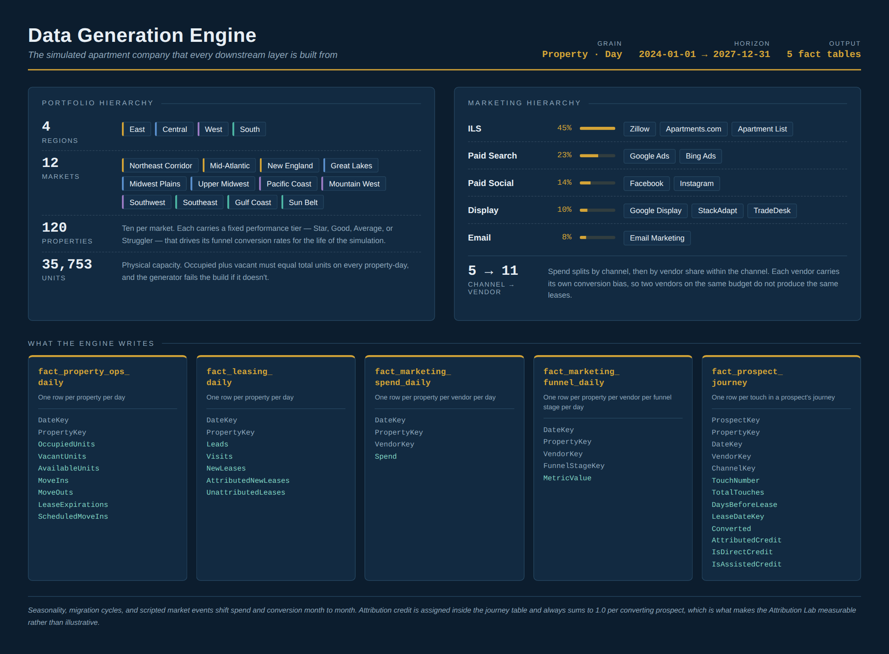
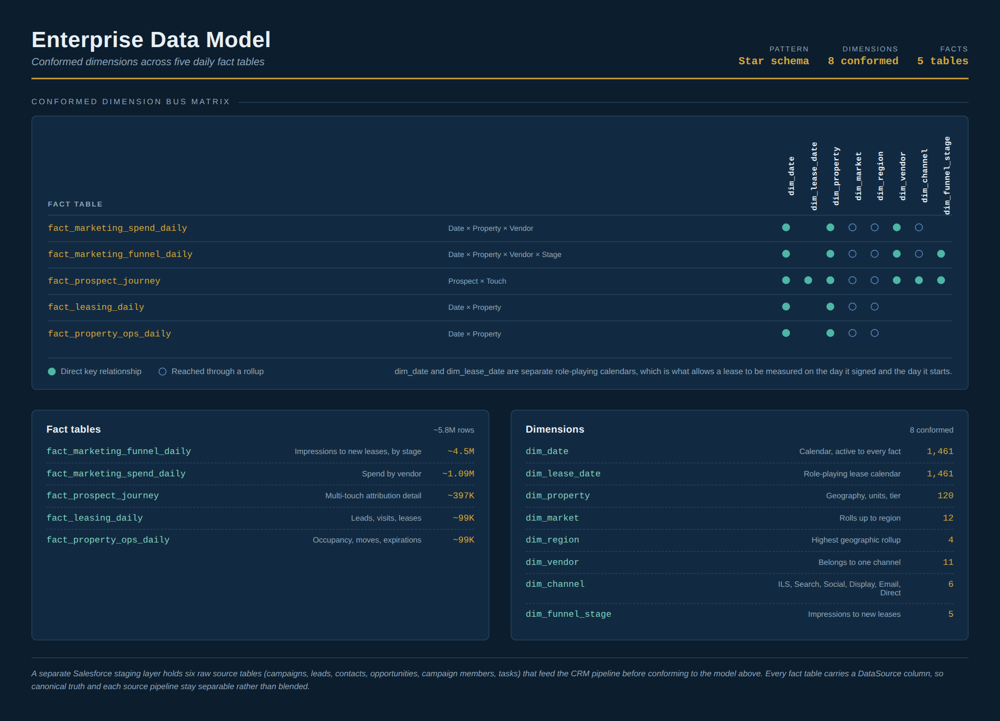
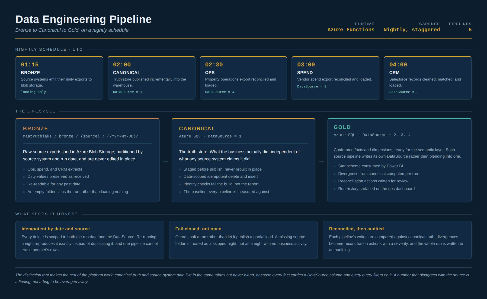
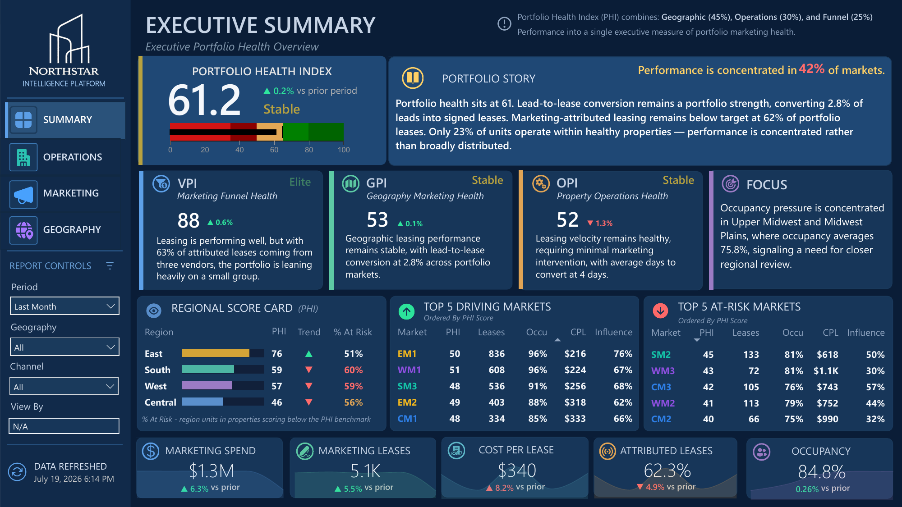
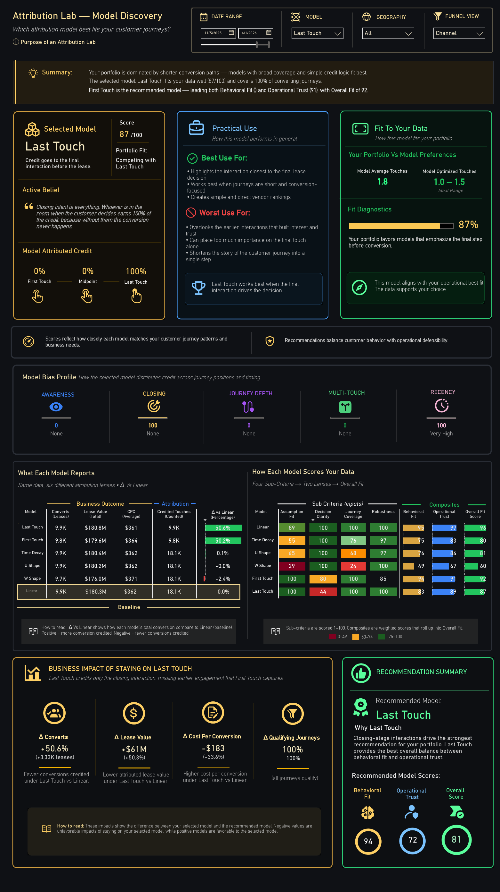
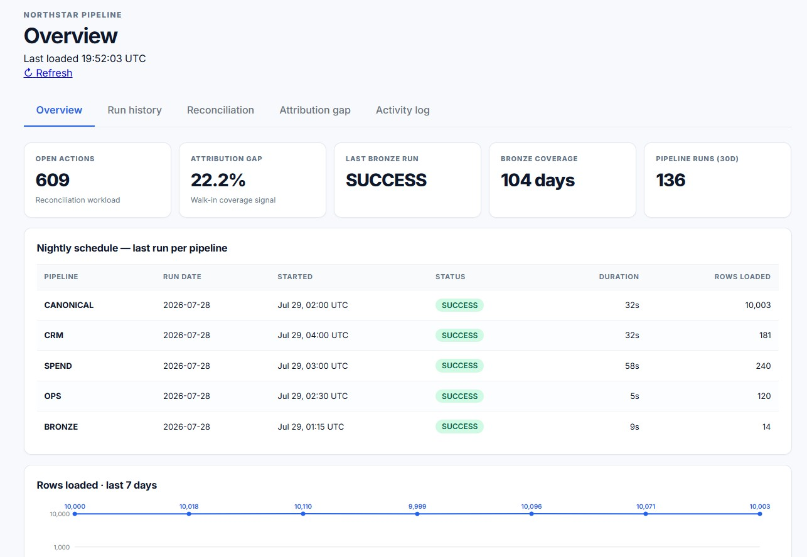

# Amir Seraj

**Business Intelligence | Data Engineering | Marketing Analytics**

For most of my career I've worked at the intersection of business and data. I've spent time in marketing analytics, operations reporting, data quality, and business intelligence, helping organizations understand what their data is actually telling them and building systems that people can trust.

As AI continues to transform the industry, I believe one thing becomes even more important: clean, well-modeled, trusted data. NorthStar brings together everything I've learned throughout my career into a single end-to-end analytics platform that demonstrates the complete lifecycle of enterprise analytics.

**[View the NorthStar Documentation →](https://ams1078.github.io/northstar-analytics-platform/)**

---

## My Career

Every role I've had taught me something different about enterprise data.

- **Dell** introduced me to CRM systems, data quality, and sales operations.
- **Quest Software** reinforced the importance of data governance and reporting.
- **Station Digital** gave me experience designing products, defining requirements, and measuring customer behavior.
- **Hyundai Motor America** exposed me to large-scale enterprise reporting, automation, and executive KPI development.
- **Mid-America Apartment Communities (MAA)** shifted my focus toward modern business intelligence, semantic modeling, and marketing analytics in Power BI.
- **Wondros** expanded that experience into healthcare, digital marketing, public-sector analytics, and enterprise measurement strategies.

NorthStar combines those experiences into one project that simulates how I would approach building an enterprise analytics platform from the ground up.

---

## Certifications

- **PL-300, Power BI Data Analyst Associate.** Semantic modeling, DAX, and report design. The modeling work throughout NorthStar builds directly on it.
- **Google Data Analytics Professional Certificate.** [Verify on Credly →](https://www.credly.com/badges/2c9f81c4-eaca-49d3-be0f-5ca94b38a756/linked_in_profile)
- **MTA: Database Administration Fundamentals.** Relational database design and administration. Credential ID 84004877.

**In progress**

- **AZ-900, Microsoft Azure Fundamentals.** Exam scheduled. NorthStar runs entirely on Azure: SQL Database, Blob Storage, Functions, and Static Web Apps.
- **Certified Data Management Professional (CDMP), DAMA International.** Data governance, quality, and metadata management, which is the discipline behind the pipeline's reconciliation and audit layers.

---

## Why I Built NorthStar

One thing I noticed throughout my career was that organizations rarely struggle because they don't have data. They struggle because the data lives in different systems, business definitions aren't consistent, reporting is fragmented, and executives spend more time questioning numbers than making decisions.

Instead of building another dashboard, I wanted to build the entire ecosystem behind it.

NorthStar starts with synthetic business operations, moves through engineering and warehousing, applies business rules and semantic modeling, and finishes with executive reporting and operational monitoring. Every layer was designed to reflect problems I've encountered in real organizations.

### See it running

All three are live, public, and refreshed against the nightly pipeline. No sign-in required.

Executive Report refreshes daily at 06:00 UTC, Attribution Lab at 07:00 UTC, and the Operations Dashboard reflects the most recent nightly run.

---

## What I Wanted to Learn

NorthStar wasn't designed to replicate work I had already done professionally. It was designed to push past it.

Semantic modeling and executive reporting were familiar ground. What wasn't: generating a behaviorally realistic business from scratch, standing up a cloud pipeline on Azure Functions and owning it through failure and recovery, building an attribution methodology defensible enough to survive a challenge, and publishing the whole thing as documentation someone else could actually navigate.

The project became less about producing a portfolio piece and more about understanding how modern analytics platforms are actually built, including the parts that don't appear in a dashboard.

---

## NorthStar Intelligence Platform

NorthStar is an enterprise analytics platform built around a national multifamily housing company. The business, the data, and the customer behavior are synthetically generated, which allows the platform to model the complete lifecycle of enterprise analytics: business activity, engineering, warehousing, semantic modeling, executive reporting, attribution analysis, and operational monitoring.

The goal wasn't to build the biggest dashboard. The goal was to demonstrate how business problems become analytics solutions.

NorthStar represents the work of a business analyst, data engineer, BI developer, semantic modeler, and technical writer working together in a single platform.

---

## Platform at a Glance

| | |
|---|---|
| **Business domain** | National multifamily housing |
| **Portfolio** | 120 properties, 35,753 apartment units |
| **Geography** | 4 regions, 12 markets |
| **Marketing** | 5 channels, 11 vendors |
| **Coverage** | Daily snapshots, 2024 through 2027 |
| **Fact tables** | Leasing, Property Operations, Marketing Spend, Marketing Funnel, Prospect Journey |
| **Data pipeline** | Azure Functions, Blob Storage, Azure SQL. Bronze → Canonical → Gold |
| **Semantic layer** | Power BI star schema, calculation groups, field parameters, and 1,289 DAX measures |
| **Executive framework** | GPI • OPI • VPI • PHI |
| **Attribution models** | 6, compared side by side |
| **Documentation** | Interactive metadata portal |
| **Technologies** | Python • SQL • DAX • Power BI • Azure |

---

### 1. Business Ecosystem

Everything starts with the business.

NorthStar simulates a national apartment company operating across multiple regions, markets, properties, marketing vendors, and leasing teams. The business behaves like a real organization, generating operational activity that feeds the rest of the platform.

The simulation is not random. Properties carry fixed performance tiers that shape their conversion rates. Markets move through seasonal leasing cycles and migration patterns. Scripted events shift budget between channels the way a real marketing team would. Every generated event is internally consistent, which means marketing, operations, and executive reporting all resolve to the same underlying business activity rather than to three separate versions of it.

---

### 2. Enterprise Data

Every business process in NorthStar eventually becomes analytical data.

Each fact table is generated independently but conforms to a shared dimensional model, so operational, marketing, and financial questions can be answered from a common semantic layer. Leasing activity, property operations, marketing spend, funnel performance, prospect journeys, and industry benchmarks are modeled into a dimensional warehouse built on star schema principles, combining shared dimensions, daily fact tables at property grain, and the business rules that support everything from operational reporting to executive scorecards.

Rather than loading a static sample dataset, the warehouse is extended every night by an automated pipeline, so the platform behaves like a living production environment rather than a snapshot.

---

### 3. Data Engineering

The engineering layer was built to resemble a production analytics pipeline rather than a classroom ETL exercise.

Business activity is processed through Azure Functions, landed in Blob Storage, reconciled against a canonical truth store, published into Azure SQL, and monitored through an operations dashboard. Each stage is isolated so that a failure in one does not silently corrupt the next.

Watermarks, idempotent processing, fail-closed guards, reconciliation, and audit logging make every nightly refresh traceable and repeatable. When something does go wrong, the platform is designed to tell you rather than quietly produce a wrong number.

The hardest part is the front door. Fourteen source files land in bronze each night across seven vendor formats, each imitating the native export of the platform it came from, because that is the problem marketing data integration actually presents. No two vendors agree on anything.

| Source | Vendors | Cost model | Property identified by |
|---|---|---|---|
| Google Ads | Search, Display | Cost per click | `Property ID` |
| Microsoft Advertising | Bing | Cost per click | `Property_ID` |
| Meta Ads Manager | Facebook, Instagram | CPM | `Property_ID` |
| Zillow Rental Manager | Zillow | Subscription plus lead fee | `Property_Key` |
| CoStar / Apartments.com | Apartments.com | Listing package | `Property_Key` |
| Apartment List | Apartment List | Pay per lease | `property_key` |
| Programmatic DSP | StackAdapt, TradeDesk | CPM | `Property_Key` |

Google Ads writes four banner lines above its header and formats currency as text. Apartment List uses snake_case while everything else uses title case. One Meta file resolves to two vendor keys. Spend arrives under seven different column names. A Yardi Voyager flat file and six raw Salesforce tables land alongside them, carrying deliberate data quality defects that the reconciliation layer classifies rather than silently repairs.

Rather than write seven bespoke loaders, the pipeline reads bronze through a parser registry. Each source is a single entry: a filename template and a parse function that returns rows in one canonical shape. The orchestration loop never learns anything about a specific vendor. Google Ads is implemented as the reference parser, covering both Search and Display, and the remaining sources are scaffolded against the same contract so that adding one is a parser module and one line rather than a change to the pipeline.

Real samples of all fourteen files are in [`sample/`](sample/).

---

### 4. Executive Intelligence

The executive reporting layer translates operational data into business decisions.

Rather than presenting isolated KPIs, NorthStar organizes performance into four executive indexes: Geographic Performance (GPI), Operations Performance (OPI), Vendor Performance (VPI), and Portfolio Health (PHI). Each one combines multiple business measures into a benchmark-relative score, so a number is always read against comparable peers rather than in isolation.

The indexes are deliberately not interchangeable. Each answers a different executive question, and each uses a normalization approach suited to what it measures. PHI blends the other three into a single portfolio view for the moments when leadership wants one number, without discarding the detail that explains it.

Refreshed daily at 06:00 UTC.

A 40-slide walkthrough of the visual logic behind all four report pages: what every element on the page does, the conditions it tests, and the arithmetic behind each decision it makes.

---

### 5. Attribution Laboratory

The Attribution Lab was built around a single question: how much does the attribution model itself change the business decision?

Six industry attribution models can be compared side by side, evaluating behavioral fit, operational trust, portfolio alignment, and the downstream business impact of switching methodology. The same underlying data, viewed through six different lenses, produces six different vendor rankings and six different budget conclusions.

Rather than declaring one model correct, the lab explains why the models disagree and what those differences mean for marketing investment. Concepts such as Behavioral Fit, Operational Trust, and Overall Fit exist to make an attribution choice defensible rather than arbitrary.

Refreshed daily at 07:00 UTC.

A 15-slide walkthrough of how the lab scores a model: the sub-criteria, the two composite lenses, the weights that roll them into Overall Fit, and the arithmetic worked end to end on a single model.

---

### 6. Pipeline Operations

Every production platform needs operational visibility.

NorthStar includes a dedicated operations portal that tracks nightly pipeline execution, reconciliation status, attribution validation, bronze data coverage, audit history, and overall system health. Run duration, row counts, and failures are visible per pipeline, per night.

The point is to demonstrate not only how analytics get built, but how they are maintained once deployed. A dashboard nobody trusts is a dashboard nobody uses, and trust is an operational property, not a design one.

Reflects the most recent nightly run.

A 10-slide walkthrough of the five tabs: what each one answers, the query behind it, and why every panel is built so that nothing missing looks like nothing wrong.

---

## Technologies

---

## Explore the Platform

If you'd like to dive deeper into the architecture, data model, engineering pipeline, executive reporting, or technical documentation, visit the NorthStar Metadata Portal.

**[NorthStar Documentation →](https://ams1078.github.io/northstar-analytics-platform/)**

---

- [LinkedIn](https://www.linkedin.com/in/amir-seraj-5234825/)
- [Resume](N/A)
- [Email](mailto:ams92690@yahoo.com)
